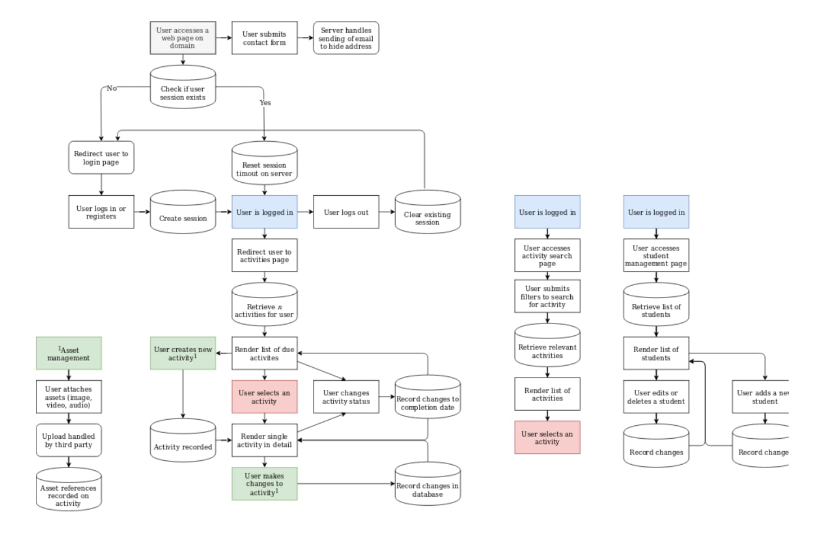
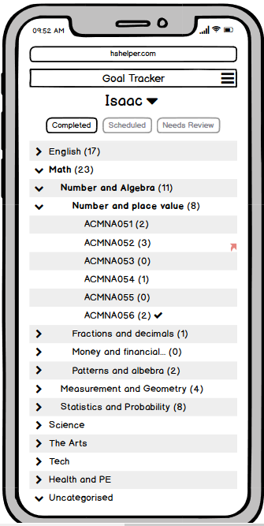
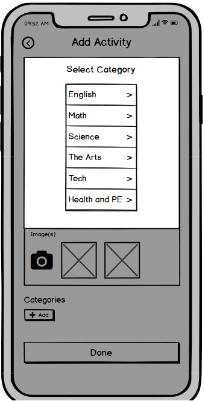
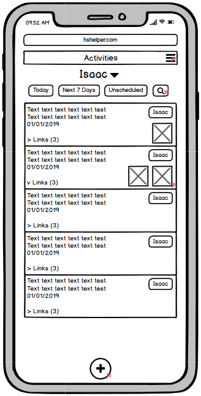
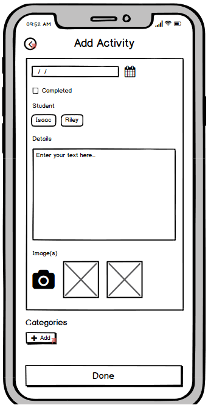
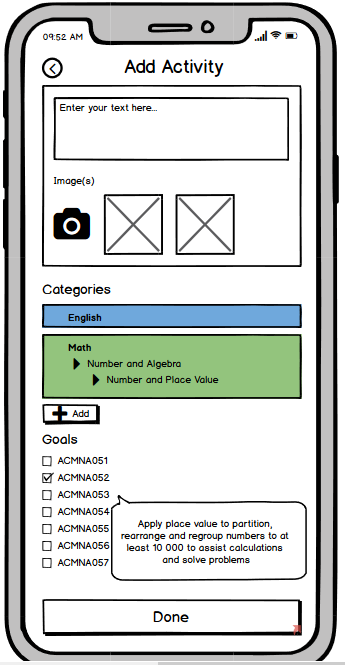
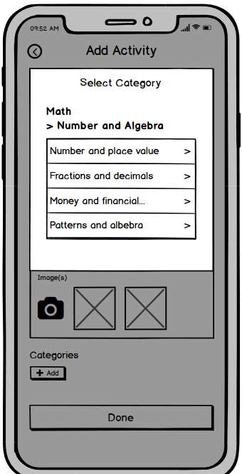
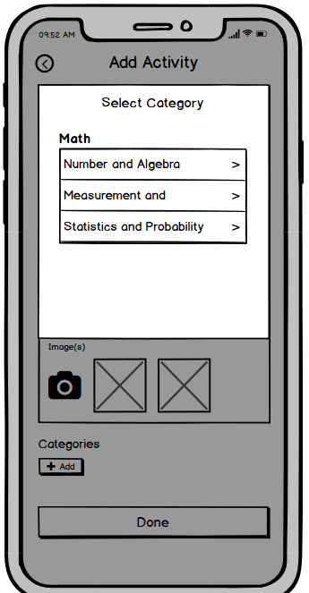

### Purpose
To create a web application to facilitate home schooling activites and tracking completion across multiple students

### Functionality / features
* Authentication
* Interface for student management
* Interface for managing activities
* Interface to find activities based on filters

### Target audience
Entity providing education - teacher/parent/tutor

### Tech stack
The tech stack for this project is MERN (MongoDB, Express, React, Node.js)

MongoDB for database, ExpressJs for the server, React for the front end.

## Data flow Diagram
#### Schema
```javascript
user: {
    name: {
        first: String,
        last: String
    },
    dateJoined: Date,
    students: [{
        type: String
    }],
    activities: [{
        name: String,
        textContent: String,
        date: Date,
        dateCompleted: Date,
        students: [{
            type: String
        }],
        assets: [{
            type: String // assuming links to external storage, data type can change
        }]
    }]
}
```
<a href="./Docs/dataflow.jpg"></a>

<a href="./Docs/dataflow.md">Accompanying dataflow document</a>

## Application Architecture Diagram

Front-end
* Reactjs

Back-end
* Express
* Mongoose

Database
* MongoDB


Image from https://www.topzenith.com/2018/04/top-10-best-mern-stack-video-tutorials.html

## User Stories

* As a user, I can set up and manage an account on the service
* As a user, I can manage a list of students
* As a user, I can manage activities including the ability to:
    * Add, edit and remove activities
    * Set a name, description and due date for an activity
    * Tag students and mark an activity as complete
    * Attach assets to an activity to provide a rich experience
    * Link activities to one another
* As a user, I can find activities based on a set of filters

## Wireframes for multiple standard screen sizes, created using industry standard software

#### Desktop
|  |||

#### Mobile
| 
 | 
 | 
 | 
 | 
 | 
 |  |


## Screenshots of your Trello board throughout the duration of the project

3/12/19


```text
Our project is to create a web application for home school educators. It needs to be responsive and fully functional on phone, tablet and desktop. At the very least it needs the following functionality...

  - Login
  - Student setup (just a name for tagging)
  - Add/Edit/Delete an "Activity". This is like a "note" that can consist of a date (past, present or future), text, photo/video/audio, "completed" flag and tag one or more students
  - Ability to view "Activities" as a task list with filters for today, this week, and future
  - Ability to search for any activity including past and "complete" activities

  If time was to permit, the next features we would like to see are...
  - Add/Edit/Delete "Goals" that can be grouped into categories and subcategories (with no limit to the number of levels)
  - An intuitive way of tagging categories/subcategories (at any level) and/or goals when adding or editing "activities"
  - The ability to view all linked "activities" within the context of a category, subcategory or goal
  - The ability to mark a goal as "achieved"
```
